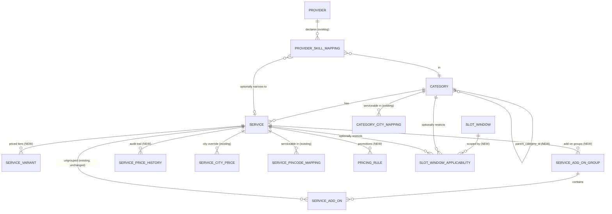
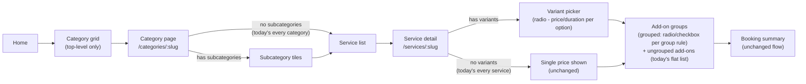

# Service Catalog Architecture Review & Redesign Proposal

**Author:** Service Catalog Architecture review (AI-assisted, grounded in the live codebase as of this document's date)
**Scope:** `backend/shared/Domain` (Category, Service, ServiceAddOn, serviceability, provider matching, slots, pricing), `backend/shared/Infrastructure/Services/PriceCalculationService.cs`, `docs/SRS.md` §12.5–12.10, `docs/PROVIDER.md`.
**Method:** Every claim below cites the actual entity, field, or service that backs it — nothing here is inferred from a generic "how these platforms usually work" template. Where the codebase already does something well, this document says so; the goal is a *targeted*, backward-compatible upgrade, not a rewrite for its own sake.

---

## 1. Executive Summary

Nestly's catalog is **more disciplined than it looks at first glance**: booking-time snapshotting, per-city price overrides, and a two-tier serviceability model are all sound, already-correct decisions worth preserving. The real problems are narrower and more fixable than "redesign everything":

1. **Categories can't nest.** Every home-services competitor (Urban Company, Housecall Pro, TaskRabbit) browses Category → Subcategory → Service. Nestly's `Category` has no parent pointer at all.
2. **Services can't have package variants.** "1 BHK / 2 BHK / 3 BHK cleaning" or "Basic / Standard / Deep" tiers are a single `Service` row with one `Price` and one `DurationMinutes` — there is nowhere to put a second price point without creating a second, disconnected `Service`.
3. **Add-ons have no grouping, exclusivity, or min/max rules.** They're a flat, independently-toggleable list — "pick exactly one mattress size" cannot be expressed.
4. **`Service.PricingType` (Fixed/Variable) is dead code.** `PriceCalculationService` never reads it. It's UI-only metadata today.
5. **The spec asked for slot windows scoped by category/service; the implementation dropped it.** SRS 12.10.1 explicitly lists "City/category/service applicability" as a required field. `SlotWindow` only has `CityId`. Every service in a city — a 30-minute AC filter check and a 4-hour deep clean — competes for the same generic capacity pool.
6. **No price history despite the domain already raising the event for it.** `ServicePriceChangedEvent` fires on every price change and currently has no listener that persists it, so SRS 12.8.2's "price change audit required" is unmet even though the hook already exists.

None of these require touching how a `Booking` snapshots itself (that pattern is correct and should not change). All six are fixable additively — new nullable columns and new tables, zero renames, zero breaking API changes — because the existing `Service.Price`/`DurationMinutes` fields become the *default variant* rather than being removed.

---

## 2. Review of the Current Implementation

### 2.1 What exists today (verified against source)

| Concept | Entity / file | Shape |
|---|---|---|
| Category | `Domain/Category.cs` | Flat. `Name`, `Slug`, `Description`, `IconUrl`, `BannerUrl`, `IsActive`, `IsFeatured`, `SortOrder`, SEO fields. **No parent pointer.** |
| Service | `Domain/Service.cs` | Belongs to exactly one `CategoryId`. One `Price`, one `DurationMinutes`. Six independent booking-behavior booleans: `IsSlotRequired`, `IsAddressRequired`, `IsCustomerNoteAllowed`, `IsInspectionBased`, `IsQuantityAllowed`, `IsAddOnAllowed`. A `PricingType` enum (`Fixed`/`Variable`) that nothing branches on. |
| Add-on | `Domain/ServiceAddOn.cs` | Flat list per service. `Price`, `IsQuantityAllowed`, `IsMandatory`, `SortOrder`. No grouping, no mutual exclusivity, no min/max selection count. |
| Category serviceability | `Domain/CategoryCityMapping.cs` | Category ↔ **City** (coarse: "do we run Home Cleaning in Bengaluru at all"). |
| Service serviceability | `Domain/ServicePincodeMapping.cs` | Service ↔ **Pincode** (fine-grained: "is Deep Home Cleaning bookable in 560034"). |
| City price override | `IServiceCityPriceRepository` (used in `PriceCalculationService`) | A service's base price can be overridden per city. **Already correct and already used** — see §2.2. |
| City pricing policy | `ICityPricingPolicyRepository` | Per-city visit charge, tax %, platform fee. **Already correct.** |
| Provider skill | `Domain/ProviderSkillMapping.cs` | Provider ↔ Category, with an *optional* narrowing `ServiceId`. Boolean qualification only — no proficiency level. |
| Provider service area | `Domain/ProviderServiceArea.cs` | Provider ↔ City, optionally narrowed to Zone and/or Pincode. Correctly mirrors the Geography module's own nesting. |
| Provider capacity | `Domain/ProviderCapacity.cs` | One row per provider: `MaxJobsPerDay`, `MaxJobsPerSlot`. Advisory only (PROVIDER.md OPEN DECISIONS #1: assignment stays manual/admin-driven in v1). Not scoped to a category or service — a provider who does both plumbing and salon work cannot have different daily limits for each. |
| Slot window | `Domain/SlotWindow.cs` | `CityId`, `Name`, `StartTime`/`EndTime`, `MaxBookingsPerSlot`. **City-level only — see Problem 5.** |
| Slot capacity counter | `Domain/SlotBookingCounter.cs` | One live counter per `(SlotWindowId, SlotDate)` — shared across every category, every service, every provider booked into that window. |
| Price calculation | `Infrastructure/Services/PriceCalculationService.cs` | `basePrice (± city override) × quantity + Σ(addon.Price × qty) + visitCharge`, then city tax % and platform fee on top. Coupons and wallet deduction are layered on separately at the booking-creation step (not in this document's scope — they already work and are untouched by this proposal). |

### 2.2 What's already right — do not change these

A redesign that "fixes" things that already work would just add churn. Three things here are genuinely well-built and this proposal deliberately leaves them alone:

- **Booking-time snapshotting.** `Booking` stores `CustomerNameSnapshot`, `AddressSnapshot`, `SlotSnapshot`, `PriceSnapshot`, and a `CouponCodeSnapshot` at creation time, independent of the live `Service`/`Category`/`Coupon` rows. This is exactly what SRS 12.8.2 demands ("historical bookings must not be altered") and is already covered by `BookingSnapshotImmutabilityTests`. **Nothing in this proposal touches how a booking is priced or recorded once created** — every change below is scoped to catalog *authoring*, not booking *history*.
- **The two-tier serviceability model.** Category→City is coarse, Service→Pincode is fine. At first glance this looks like an inconsistency ("why aren't both mapped at the same level?"), but it's actually the right shape: a real rollout activates a category broadly in a city, then dials in which specific services are ready pincode-by-pincode as ground reality (provider coverage, local demand) becomes clear. This is the same two-step activation pattern used across the industry. Recommendation: **keep as-is**, just document the rule explicitly (a service mapping is only meaningful if its category is also city-active — worth a validation check, not a schema change).
- **The six per-service booking-behavior booleans** (`IsSlotRequired`, `IsAddressRequired`, etc.). It's tempting to call six booleans "not scalable" and propose a generic rules engine. For six independently-meaningful, rarely-changing flags, that would be over-engineering — a real YAGNI violation. **Keep as-is.**

---

## 3. Identified Design Problems

Each problem below states the gap, the evidence, and the concrete business cost of leaving it unfixed.

### Problem 1 — Categories cannot nest
**Evidence:** `Category` has no `ParentCategoryId`. SRS 12.5 never asked for nesting either — this is a product gap the spec itself under-scoped, not just an implementation slip.
**Cost:** "Home Cleaning" cannot have "Kitchen Cleaning" / "Bathroom Cleaning" / "Full Home Cleaning" as subcategories the way every competitor browses. Today the only way to fake this is to make each of those a *sibling top-level category*, which pollutes the homepage category grid with what should be one entry.

### Problem 2 — Services cannot have priced variants/packages
**Evidence:** `Service` has exactly one `Price` and one `DurationMinutes` (`Domain/Service.cs:20,36`). There is no child entity for "same service, different size/tier, different price."
**Cost:** "AC Repair — Split AC" vs. "AC Repair — Window AC" (different price, different duration, same inclusions/policies/images) must today be modeled as two entirely separate `Service` rows with duplicated metadata, or squeezed awkwardly into add-ons (which then also can't express "pick exactly one").

### Problem 3 — Add-ons are a flat, independent list
**Evidence:** `ServiceAddOn` has no group/parent concept (`Domain/ServiceAddOn.cs`). Every add-on for a service is an independent optional toggle.
**Cost:** Cannot express "choose one of: 1 BHK / 2 BHK / 3 BHK" (mutually exclusive) or "select up to 2 of these 5 extras" (bounded multi-select) — both extremely common in real service catalogs.

### Problem 4 — `PricingType` is inert metadata
**Evidence:** `PriceCalculationService.CalculateAsync` (`Infrastructure/Services/PriceCalculationService.cs:39-104`) never reads `service.PricingType`. Every service, regardless of whether it's flagged `Fixed` or `Variable`, is priced by the identical `base × qty + addons` formula.
**Cost:** The flag actively misleads — an admin who sets a service to "Fixed package price" gets no different pricing behavior than "Variable," so the field currently documents an intention the code doesn't honor. This is worse than not having the field at all.

### Problem 5 — Slot windows lost their category/service scoping between spec and implementation
**Evidence:** SRS 12.10.1 explicitly requires "City/category/service applicability" as a slot configuration field. `SlotWindow` (`Domain/SlotWindow.cs`) has only `CityId`. `SlotBookingCounter` keys on `(SlotWindowId, SlotDate)` only — one shared capacity pool per city-window-day, regardless of which service or category is being booked into it.
**Cost:** This is the highest-impact gap in the catalog. A 30-minute AC filter check and a 4-hour deep-home-cleaning job draw from the exact same slot capacity today. A city can't run a salon-only evening window separate from its general home-repair morning window. This directly limits how realistically Nestly can schedule providers as the catalog grows past a single "one service fits all slots" category.

### Problem 6 — No price-change audit trail, despite the event already existing
**Evidence:** `Service.SetPrice` raises `ServicePriceChangedEvent(Id, oldPrice, Price)` (`Domain/Service.cs:101-108`) on every price change. There is no handler anywhere in `Infrastructure/Services` that persists this to a queryable history table.
**Cost:** SRS 12.8.2 requires "price change audit." Today that data only exists transiently in the event bus at the moment of the change — nothing durable is stored specifically for "show me this service's price history." (The general `AuditLog` module may catch some of this incidentally, but there's no dedicated, service-scoped price-history view.)

### Problem 7 — Provider capacity isn't scoped to what the provider actually does
**Evidence:** `ProviderCapacity` (`Domain/ProviderCapacity.cs`) is one row per provider — `MaxJobsPerDay`/`MaxJobsPerSlot` with no category or service dimension.
**Cost:** A provider skilled in both plumbing (`ProviderSkillMapping` → Category A) and appliance repair (→ Category B) can't have a lower daily cap for the more time-consuming category. Minor today (capacity is advisory-only per PROVIDER.md OPEN DECISIONS #1), but worth flagging for when automated dispatch eventually reads these limits.

### Problem 8 — Promotional/time-bound pricing has no home
**Evidence:** SRS 12.8.1 asks for "Promotional price." The only price-shaping mechanisms that exist are `ServiceCityPrice` (a standing per-city override, no start/end date) and the customer-facing `Coupon` system (code-driven, not admin-scheduled blanket pricing).
**Cost:** Admin cannot schedule "20% off Deep Cleaning, this weekend only" without either manually editing `Service.Price` twice (with the change-audit gap from Problem 6 compounding this) or issuing a coupon that requires the customer to know a code.

---

## 4. How This Compares to Industry Practice

Without copying any competitor's schema, the pattern shared by Urban Company, Housecall Pro, and TaskRabbit is consistent enough to call a genuine best practice, and it maps directly onto Problems 1–3:

- **A category tree**, typically 2–3 levels deep, used for browsing — not for pricing or eligibility, which both live lower down.
- **The sellable unit is a "package/variant," not the category or the top-level service name.** The service *name* ("Bathroom Cleaning") is marketing/browsing metadata; the *variant* ("1 Bathroom" vs. "2 Bathrooms," each its own price and duration) is what actually gets added to a cart and booked.
- **Add-ons are grouped**, with a group-level selection rule (single-choice / bounded multi-choice), not a flat toggle list.
- **Provider eligibility and service-area coverage are separate axes** that both gate whether a provider can be offered a job — which Nestly already does correctly via `ProviderSkillMapping` + `ProviderServiceArea`. No change needed here; it's called out to confirm the existing design already matches industry norms.

The proposal in §5 adopts these *shapes* while keeping Nestly's own naming, its own snapshot-based booking model, and its own two-tier serviceability rule — it is not a port of any specific platform's schema.

---

## 5. Proposed Domain Model

Every addition below is **additive**: new nullable columns, new child tables, zero renames or removals. `Service.Price`/`DurationMinutes` become the *default variant's* values rather than being deleted, so every existing booking, price-calculation call, and API contract keeps working unchanged for a service that never grows a second variant.



### 5.1 Category tree (fixes Problem 1)

- Add `ParentCategoryId (Guid?, FK → Category.Id, nullable)`.
- No `CategoryLevel` column needed — depth is derived by walking `ParentCategoryId`, matching how `ProviderServiceArea` already derives specificity from optional `ZoneId`/`PincodeId` rather than storing a redundant level number.
- All existing fields (name, slug, SEO, icon, banner, sort order) apply at every level unchanged. A category with `ParentCategoryId = null` is what "category" means today; nothing about existing top-level categories changes.
- Constraint: a category may not be its own ancestor (validated in the application layer on `SetParent`, the same way `Service.SetDuration` validates `> 0` today).

### 5.2 Service variants (fixes Problem 2)

New entity `ServiceVariant`:

| Field | Type | Notes |
|---|---|---|
| `Id` | Guid | |
| `ServiceId` | Guid | FK → Service |
| `Name` | string | e.g. "2 BHK", "Deep Clean" |
| `Price` | decimal | |
| `DurationMinutes` | int | |
| `InclusionsOverride` | string? | Null = inherit the parent Service's Inclusions |
| `IsActive` | bool | |
| `SortOrder` | int | |

`Service.Price`/`DurationMinutes` remain and become the values used when a service has no explicit variants (today's every-existing-service case, unchanged). `BookingSummaryRequest` gains an **optional** `ServiceVariantId`; `PriceCalculationService` resolves price/duration from the variant when supplied, falling back to `Service` itself when it isn't. No existing caller breaks.

### 5.3 Add-on groups (fixes Problem 3)

New entity `ServiceAddOnGroup`:

| Field | Type | Notes |
|---|---|---|
| `Id` | Guid | |
| `ServiceId` | Guid | FK → Service |
| `Name` | string | e.g. "Choose your extras" |
| `SelectionType` | enum: `Single` \| `Multiple` | |
| `MinSelect` | int | 0 for optional |
| `MaxSelect` | int? | Null = unbounded (only meaningful when `Multiple`) |

`ServiceAddOn` gains `GroupId (Guid?, FK, nullable)`. An add-on with `GroupId = null` behaves exactly as every existing add-on does today (independent optional toggle) — fully backward compatible.

### 5.4 Pricing: retire the dead flag, add real promotional pricing (fixes Problems 4, 6, 8)

- **Deprecate `Service.PricingType`** rather than repurpose it: once variants and add-on groups exist, "fixed vs. variable" is *derived* (zero variants + no mandatory grouped add-ons = fixed; anything else = variable), not admin-declared. Keep the column for one release (unread, as it is today) to avoid a breaking schema change, then drop it in a later migration once the frontend stops reading it.
- New entity `ServicePriceHistory` (append-only): `ServiceId`, `OldPrice`, `NewPrice`, `ChangedAtUtc`, `ChangedByAdminUserId`. Populated by a new `MediatR` handler on the **already-existing** `ServicePriceChangedEvent` — this is the cheapest fix in the whole document, since the event is already raised on every `SetPrice` call.
- New entity `PricingRule`: `ServiceId`, `DiscountType` (`Percentage` \| `FlatAmount`), `Value`, `EffectiveFromUtc`, `EffectiveToUtc`, `IsActive`. `PriceCalculationService` checks for an active rule the same way it already checks `ServiceCityPrice` — same pattern, new table, no change to the coupon system.

### 5.5 Slot applicability (fixes Problem 5 — the highest-priority fix)

New entity `SlotWindowApplicability`: `SlotWindowId`, `CategoryId (Guid?)`, `ServiceId (Guid?)`.

- **No rows for a given `SlotWindowId`** → that window applies to every category/service in its city, exactly today's behavior. Every existing `SlotWindow` needs zero data migration.
- **One or more rows** → the window is restricted to those categories/services only.
- `SlotAvailabilityService` (which already filters windows by city) adds one more filter step: given a booking's `ServiceId`, only offer windows with no applicability rows *or* a matching row.
- Phase 2 (not in this migration, flagged for later): if per-service capacity pooling is ever needed, `SlotBookingCounter` would key on `(SlotWindowId, ServiceId?, SlotDate)` instead of `(SlotWindowId, SlotDate)`. Not proposed now — the city-wide shared counter is simpler and adequate until real contention data says otherwise (avoiding premature optimization).

### 5.6 Provider capacity by category (fixes Problem 7, low priority)

Add nullable `CategoryId` to `ProviderCapacity`, allowing (but not requiring) a provider to declare a different `MaxJobsPerDay` per category. A row with `CategoryId = null` is the provider's overall default, unchanged from today.

---

## 6. Recommended Database Schema

Column naming follows the project's existing `snake_case` convention (see any current migration under `database/migrations`). Only new/changed tables are shown; every existing table keeps its current columns.

```sql
-- Problem 1: category tree
ALTER TABLE category ADD COLUMN parent_category_id uuid NULL REFERENCES category(id);
CREATE INDEX ix_category_parent_category_id ON category(parent_category_id);

-- Problem 2: service variants
CREATE TABLE service_variant (
    id uuid PRIMARY KEY,
    service_id uuid NOT NULL REFERENCES service(id),
    name varchar(200) NOT NULL,
    price numeric(10,2) NOT NULL CHECK (price > 0),
    duration_minutes int NOT NULL CHECK (duration_minutes > 0),
    inclusions_override varchar(4000) NULL,
    is_active boolean NOT NULL DEFAULT true,
    sort_order int NOT NULL DEFAULT 0
);
CREATE INDEX ix_service_variant_service_id ON service_variant(service_id);

-- Problem 3: add-on groups
CREATE TABLE service_add_on_group (
    id uuid PRIMARY KEY,
    service_id uuid NOT NULL REFERENCES service(id),
    name varchar(200) NOT NULL,
    selection_type varchar(20) NOT NULL, -- 'Single' | 'Multiple'
    min_select int NOT NULL DEFAULT 0,
    max_select int NULL,
    sort_order int NOT NULL DEFAULT 0
);
ALTER TABLE service_add_on ADD COLUMN group_id uuid NULL REFERENCES service_add_on_group(id);
CREATE INDEX ix_service_add_on_group_id ON service_add_on(group_id);

-- Problem 6: price history (backed by the existing ServicePriceChangedEvent)
CREATE TABLE service_price_history (
    id uuid PRIMARY KEY,
    service_id uuid NOT NULL REFERENCES service(id),
    old_price numeric(10,2) NOT NULL,
    new_price numeric(10,2) NOT NULL,
    changed_at_utc timestamptz NOT NULL,
    changed_by_admin_user_id uuid NULL REFERENCES admin_user(id)
);
CREATE INDEX ix_service_price_history_service_id ON service_price_history(service_id, changed_at_utc DESC);

-- Problem 8: promotional pricing
CREATE TABLE pricing_rule (
    id uuid PRIMARY KEY,
    service_id uuid NOT NULL REFERENCES service(id),
    discount_type varchar(20) NOT NULL, -- 'Percentage' | 'FlatAmount'
    value numeric(10,2) NOT NULL CHECK (value > 0),
    effective_from_utc timestamptz NOT NULL,
    effective_to_utc timestamptz NOT NULL,
    is_active boolean NOT NULL DEFAULT true,
    CHECK (effective_to_utc > effective_from_utc)
);
CREATE INDEX ix_pricing_rule_service_id_effective ON pricing_rule(service_id, effective_from_utc, effective_to_utc);

-- Problem 5: slot applicability
CREATE TABLE slot_window_applicability (
    id uuid PRIMARY KEY,
    slot_window_id uuid NOT NULL REFERENCES slot_window(id),
    category_id uuid NULL REFERENCES category(id),
    service_id uuid NULL REFERENCES service(id),
    CHECK (category_id IS NOT NULL OR service_id IS NOT NULL)
);
CREATE INDEX ix_slot_window_applicability_window ON slot_window_applicability(slot_window_id);

-- Problem 7: category-scoped provider capacity
ALTER TABLE provider_capacity ADD COLUMN category_id uuid NULL REFERENCES category(id);
```

No `ALTER TABLE ... DROP COLUMN` anywhere. `service.pricing_type` is left in place per §5.4's deprecation plan.

---

## 7. API Design Recommendations

Existing routes (`/api/v{version}/categories`, `/api/v{version}/services/{slug}`, `/api/v{version}/admin/catalog/*`) keep their shapes. Additive changes only:

- `GET /api/v1/categories?cityId=` — response gains an optional `subcategories: CategorySummary[]` field, empty for any category with no children (i.e. every category as it exists today).
- `GET /api/v1/services/{slug}` — response gains an optional `variants: ServiceVariantResponse[]` (empty array when the service has none) and `addOnGroups: ServiceAddOnGroupResponse[]` (existing ungrouped add-ons continue to appear in today's flat `addOns` array unchanged).
- `POST /api/v1/bookings/summary` — request gains an optional `serviceVariantId`. Omitted = today's exact behavior (price/duration from `Service` itself).
- New admin endpoints, following the existing `AdminModules` permission-per-module pattern:
  - `POST/PUT /api/v1/admin/catalog/services/{id}/variants`
  - `POST/PUT /api/v1/admin/catalog/services/{id}/add-on-groups`
  - `GET /api/v1/admin/catalog/services/{id}/price-history`
  - `POST/PUT /api/v1/admin/catalog/services/{id}/pricing-rules`
  - `POST/PUT /api/v1/admin/slots/windows/{id}/applicability`

---

## 8. UI Hierarchy for Browsing



The key property: a category with no children and a service with no variants render **exactly as they do today** — this hierarchy is a superset of the current UI, not a replacement for it.

---

## 9. Admin Management Flow

- **Catalog → Categories**: existing screen gains a "Parent category" select (optional) on the create/edit form — same pattern as the existing Provider Assignment screen's optional dropdowns.
- **Catalog → Services → [service] → Variants** (new tab, alongside the existing "Add-ons" tab): list + inline create, mirroring the existing add-on management UI exactly (same table/form shape, new entity).
- **Catalog → Services → [service] → Price history** (new tab): read-only table sourced from `service_price_history`, populated automatically — no new admin workflow to learn, since it's just a log of edits made through the existing price field.
- **Slots & Availability**: existing "Add a window" form gains an optional "Restrict to categories/services" multi-select, defaulting to unrestricted (today's behavior) when left empty.

---

## 10. Booking Flow Impact

`BookingSummaryService` and `BookingService.CreateAsync` need exactly two additions, both optional-input, non-breaking:

1. Resolve `ServiceVariantId` (if provided) to get price/duration instead of reading `Service` directly — one extra branch, same shape as the existing `cityOverride ?? service.Price` fallback pattern already used in `PriceCalculationService`.
2. `SlotAvailabilityService`'s window query adds the applicability filter from §5.5.

The booking snapshot itself (`PriceSnapshot`, `SlotSnapshot`) is unaffected — it already stores whatever price/duration was resolved at booking time, regardless of where that number came from.

---

## 11. Migration Strategy

Four independent phases, each shippable and safe on its own — no phase requires a later phase to be "correct" in the interim.

| Phase | Scope | Risk | Why this order |
|---|---|---|---|
| **1** | `service_price_history` + event handler (Problem 6) | Near-zero — additive table, existing event, no API surface change at all | Cheapest fix, immediately closes an SRS compliance gap, validates the migration pipeline before touching anything customer-facing |
| **2** | `SlotWindowApplicability` (Problem 5) | Low — every existing window has zero applicability rows, so behavior is provably unchanged until an admin opts in per window | Highest business value (real per-service scheduling), fully backward compatible by construction |
| **3** | Category tree + Service variants + Add-on groups (Problems 1, 2, 3) | Medium — largest surface area, touches both admin and customer UI | Batched together because variants and add-on groups are naturally exposed on the same service-detail admin screen and customer page |
| **4** | `PricingRule` promotional pricing + `PricingType` deprecation (Problems 4, 8) | Low | Deliberately last: benefits from Phase 3's variant model existing first, since a promotional rule is more useful once there's more than one price point to discount |

Each phase: write the EF Core migration, add the repository/service methods (following the exact patterns already in `PriceCalculationService`/`AdminChatService` — batched lookups, no N+1, per this codebase's established conventions), add tests before wiring the API, then the admin UI, then the customer UI. No phase requires downtime or a data backfill beyond the schema change itself, since every new column is nullable and every new table starts empty.

---

## 12. Summary

The catalog's foundations — snapshotting, two-tier serviceability, per-city pricing — are solid and are explicitly left untouched. The eight problems identified are real, each backed by a specific line of code or a specific line of the spec that the implementation didn't fulfill, and each has an additive fix that a production booking platform (Urban Company, Housecall Pro, TaskRabbit) already validates as the right shape. Total new tables: 5. Total altered tables: 3 (each gaining one nullable column). Zero breaking changes to any existing API contract, booking record, or admin workflow.
